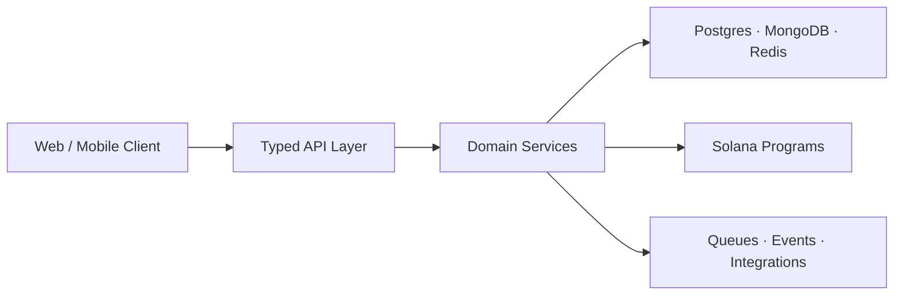

<div align="center">


<a href="https://git.io/typing-svg"></a>

[](https://xaidenlabs.com.ng)
[](https://linkedin.com/in/alfred-gabriel-5529a926a)
[](https://twitter.com/xaidenlabs)
[](mailto:hello@xaidenlabs.com.ng)


</div>

## `whoami`

<table>
  <tr>
    <td width="31%" align="center" valign="middle">
      
      <br /><br />
      <b>Alfred Gabriel</b><br />
      <sub>Founder, Xaiden Labs · @XaidenLabs</sub>
    </td>
    <td width="69%" valign="top">
      <pre>
alfred@xaidenlabs:~$ ./introduce --professional

ROLE        Full-Stack & Backend Engineer
SPECIALTY   APIs · Distributed Workflows · Web3
WEB         Next.js · React · Tailwind CSS
BACKEND     Node.js · NestJS · Laravel · Express
DATA        PostgreSQL · MongoDB · Redis
ON-CHAIN    Solana · Anchor · Rust · SPL Tokens
DELIVERY    Docker · CI/CD · Vercel · Linux

MISSION     Build useful products. Engineer them to last.
STATUS      Shipping in public ██████████████ 100%
      </pre>
    </td>
  </tr>
</table>

## Proof of work

<table>
  <tr>
    <td width="33%" valign="top">
      <h3>◈ Africa Research Base</h3>
      <p><b>Research · Data · Funding</b></p>
      <p>A product ecosystem designed to help African researchers discover data, collaborate, access funding, and participate in token-powered research incentives.</p>
      <p><code>Next.js</code> <code>TypeScript</code> <code>Solana</code> <code>Supabase</code></p>
    </td>
    <td width="33%" valign="top">
      <h3>◎ Worksafe</h3>
      <p><b>Trust-minimised Escrow</b></p>
      <p>A freelance transaction layer with PDA-based escrow, SPL-token settlement, release and refund paths, disputes, fees, and admin resolution.</p>
      <p><code>Rust</code> <code>Anchor</code> <code>SPL</code> <code>Next.js</code></p>
    </td>
    <td width="33%" valign="top">
      <h3>⌁ Xaiden Labs</h3>
      <p><b>Product Engineering Studio</b></p>
      <p>Practical web, mobile, backend, AI-assisted, and blockchain products built around real operational problems and scalable foundations.</p>
      <p><code>Node.js</code> <code>Laravel</code> <code>React</code> <code>Mobile</code></p>
    </td>
  </tr>
</table>

<div align="center">

[**Explore the portfolio →**](https://xaidenlabs.com.ng) &nbsp;&nbsp; [**Inspect the repositories →**](https://github.com/XaidenLabs?tab=repositories)

</div>

## Engineering depth



| I build | What that means in practice |
| --- | --- |
| **Backend platforms** | Versioned APIs, authentication, authorization, validation, payments, queues, caching, uploads, observability, and integrations. |
| **Full-stack products** | Accessible interfaces connected to maintainable domain logic—not disconnected screens and endpoints. |
| **On-chain systems** | Program-derived accounts, token transfers, escrow state machines, wallet flows, and explicit security constraints. |
| **Delivery pipelines** | Repeatable environments, automated checks, containerized services, deployment workflows, and clean handover documentation. |

## Technology radar

<div align="center">


<br /><br />

**Core:** TypeScript · Node.js · Laravel · Next.js &nbsp;|&nbsp;
**Systems:** PostgreSQL · MongoDB · Redis · Docker &nbsp;|&nbsp;
**Web3:** Solana · Anchor · Rust

</div>

## Operating principles

```ts
const engineering = {
  startWith: "the user and the real constraint",
  designFor: ["clarity", "security", "failure", "scale"],
  proveWith: ["working software", "tests", "documentation", "metrics"],
  improveThrough: "small, deliberate iterations",
  defaultAction: "ship",
} as const;
```

## Live engineering signal

<div align="center">
  
  
  
  
</div>

### Contribution stream

<picture>
  <source media="(prefers-color-scheme: dark)" srcset="https://raw.githubusercontent.com/XaidenLabs/XaidenLabs/output/github-contribution-grid-snake-dark.svg" />
  <source media="(prefers-color-scheme: light)" srcset="https://raw.githubusercontent.com/XaidenLabs/XaidenLabs/output/github-contribution-grid-snake.svg" />
  
</picture>

<details>
  <summary><b>More repository intelligence</b></summary>
  <br />
  <div align="center">
    
    
  </div>
</details>

## Current direction

- Deepening **Rust, Solana program security, and protocol design**.
- Building **AI-assisted developer tools and agent-powered workflows**.
- Creating **African-first products** with globally competitive engineering.
- Open to **backend roles, contract builds, and serious product collaborations**.

<div align="center">

## Let’s build something that matters

If the problem is technically ambitious and useful in the real world, I want to hear about it.

[](mailto:hello@xaidenlabs.com.ng)

<br />


<sub><b>Alfred Gabriel</b> — engineering ideas into dependable products.</sub>

</div>
